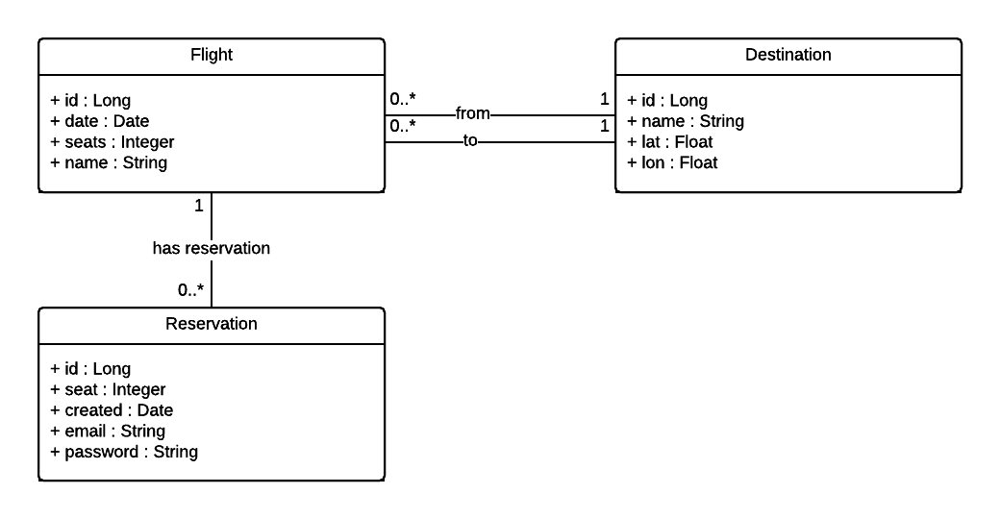

# a4m36jee-project
[](https://travis-ci.org/klimesf/a4m36jee-project)

Semestrlání projekt v předmětu [A4M36JEE](https://developer.jboss.org/wiki/AdvancedJavaEELabFELCVUTPodzim2016) na FEL ČVUT.

Nasazeno na Openshift Developer Preview: [http://a4m36jee-project-a4m36jee-airlines.44fs.preview.openshiftapps.com](http://a4m36jee-project-a4m36jee-airlines.44fs.preview.openshiftapps.com).

## Team

- Filip Klimeš (vedoucí)
- Jakub Moravec
- ~~Michal Kašpar~~
- Ondřej Kratochvíl
- Ondřej Slavíček

## Specifikace

Realizujte projekt letecké společnosti pro plánování a rezervaci letů.
Hlavním požadavkem na realizaci produktu je implementace RESTful API, které spravuje dostupné datové zdroje:
Destination (seznam destinací, kam společnost létá), Flight (seznam plánovaných, zrušených i uskutečněných letů)
a Reservation (rezervace určitého počtu míst ve zvoleném letu).
Součástí implementace musí být i tenký klient implementovaný jako webová stránka prohlížeče.
Aplikace dále musí umět odeslat e-mail o potvrzení rezervace po jejím vytvoření.
Zároveň je potřeba nahrávat seznam letů ve formátu CSV pomocí dávkových operací.



## Git WorkFlow

[Feature Branch Workflow](https://www.atlassian.com/git/tutorials/comparing-workflows/feature-branch-workflow)

## Checklist

- [X] Každý student si zřídí účet na github.com, zdrojové kódy projektu budou tamtéž
- [X] Volba git workflow je na každém týmu, taktéž rozdělení prací na projektu
- [ ] Vytvořit krátkou specifikaci - textovou či s doprovodem UML diagramů
- [ ] Implementace třívrstvé aplikace
  - [ ] Prezentační vrstva - JSF (volitelně použití knihovny RichFaces) nebo moderní JavaScriptový framework s REST backendem, hodnotit se bude funkcionalita, nikoliv grafické provedení
  - [X] Business vrstva - EJB
  - [X] Datová vrstva - perzistence pomocí JPA 2 nebo Infinispan (zde se očekává konfigurace Infinispan-u pro trvalé uložení dat)
- [X] Aplikace bude používat CDI, není vhodné používat dependency injection definovanou v Java EE 5 (tzn. očekáváme i použití např. typově bezpečného persitence contextu)
- [X] Aplikace bude plně zabezpečena, bude používat minimálně tři úrovně oprávnění (role)
- [X] Datový model bude anotovaný pomocí Bean Validation - stačí použít předdefinované anotace, použití i vlastních omezení je plus
- [X] Aplikace bude testovatelná (Arquillian)
- [ ] Aplikace bude nasazena v clusteru dvou uzlů v doménové konfiguraci, přiložen konfigurační skript (JBoss CLI) a demonstrována její odolnost vůči výpadku jednoho z nich (lze simulovat na jednom počítači)
- [ ] Aplikace bude dodána též
  - [ ] nasazená aplikace bežící v OpenShift 3 (developer preview)
  - [ ] volitelně jako standalone fatjar pomocí WildFly Swarm
- [X] Aplikace bude vystavovat rozhraní pro komunikaci mezi systémy (JAX-RS) - formát zpráv JSON
- [ ] Aplikace bude používat alespoň jeden WebSocket endopint
- [ ] Aplikace bude volat alespoń jeden REST endpoint (JAX-RS)
- [ ] Vystavené endpointy budou podoporovat zabezpečení
- [ ] Aplikace bude obsahovat alespoň jeden use case pro použití Concurrency nebo Batching API
- [ ] Aplikace bude obsahovat alespoň jeden use case pro použití JMS 2.0 API
- [ ] Každý projekt bude prezentován, studenti budou tázáni na části, které implementovali a technologie, které použili

## Rozdělení prací

| Úkol                      | FK    | JM    | ~~MK~~| OK    | OS    |
| ------------------------- | :---: | :---: | :---: | :---: | :---: |
| Specifikace + UML         | X     |       |       |       |       |
| JPA 2 + Bean Validation   | X     |       |       | X     |       |
| Byznys vrstva             |       | X     |       |       |       |
| Prezentační vrstva        |       |       |       |       |   X   |
| WebSocket                 |       | X     |       |       |       |
| Arquillian                | X     |       |       |       |       |
| Security                  |       |       |       | X     |       |
| JMS                       |       |       |       | X     |       |
| REST + Security           | X     | X     |       |       |       |
| Concurrency/Batching      |       |       |       |       |       |
| Openshift / Swarm Fatjar  | X     |       |       |       |       |
| Clustering                | X     |       |       |       |       |
| Prezentace                | X     |       |       |       |       |

## Deployment & testing

Deploying via Maven (Wildfly musí být spuštěný na standardním portu)

```bash
mvn clean package wildfly:deploy
```

Testing via Maven (Wildfly musí být spuštěný na standardním portu)

```bash
mvn clean package test -Parq-wildfly-remote
```
